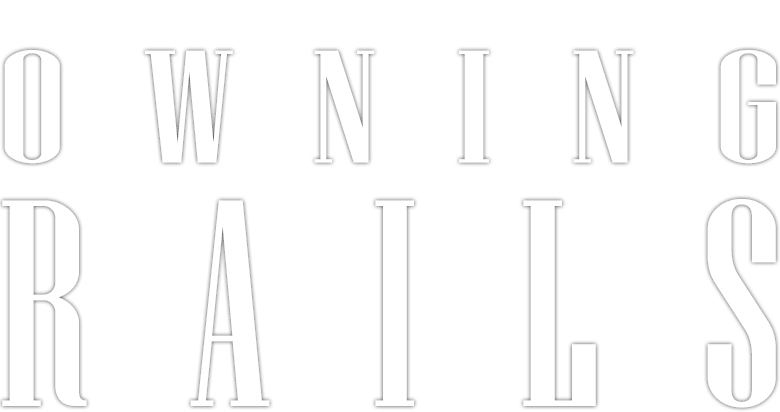

<h1 align="center">
    
    <br><br>Mini Rails<br/>
</h1>
<p align="center">
  

  

  <br />
</p>

<br />

## :bookmark: About

Mini Rails is a gem developed during the Owning Rails course. Aiming the understanding of the inner workings of the Rails framework, it covered the implementation from scratch of the Rails gem itself, along with its other supporting gems:

* ActiveRecord
* ActiveSupport
* Railties
* ActionController
* ActionDispatch
* ActionView


## :floppy_disk: Dependencies

-  [Ruby](https://www.ruby-lang.org/en/) - v2.7.0


## Installation

Add this line to your application's Gemfile:

```ruby
gem 'mini-rails'
```

And then execute:

    $ bundle install

Or install it yourself as:

    $ gem install mini-rails

## Development

After checking out the repo, run `bin/setup` to install dependencies. Then, run `rake test` to run the tests. You can also run `bin/console` for an interactive prompt that will allow you to experiment.

To install this gem onto your local machine, run `bundle exec rake install`. To release a new version, update the version number in `version.rb`, and then run `bundle exec rake release`, which will create a git tag for the version, push git commits and tags, and push the `.gem` file to [rubygems.org](https://rubygems.org).
